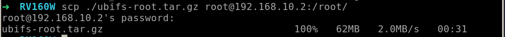

# Cisco RV160W 固件模拟

本次进行的固件模拟，依旧是基于 Cyberangel 师傅的博客进行学习。指北：[ Cyberangle 公开知识库 ](https://www.yuque.com/cyberangel/rg9gdm)

先对获得的固件进行解压、打包备用。


设置网桥、启动虚拟机，给出代码和截图。

```bash
# 创建网桥
sudo brctl addbr ms_br # 创建一个名为`ms_br`的网桥设备
sudo ip link set ms_br up  # （启动）刚刚创建的网桥`ms_br`，使其处于活动状态
sudo ip addr add 192.168.10.1/24 dev ms_br # 给网桥`ms_br`分配一个IP地址`192.168.10.1`

# 创建并连接TAP设备
sudo ip tuntap add dev ms_tap mode tap  # 创建一个TAP设备，命名为`ms_tap`
sudo brctl addif ms_br ms_tap # 将TAP设备`ms_tap`添加到网桥`ms_br`中
sudo ip link set ms_tap up # 启用TAP设备`ms_tap`
sudo ip addr add 192.168.10.10/24 dev ms_tap # 给`my_tap`分配一个IP地址`192.168.10.10`
```

开启虚拟机：

```bash
sudo qemu-system-arm \
  -M vexpress-a9 \
  -kernel vmlinuz-3.2.0-4-vexpress \
  -initrd initrd.img-3.2.0-4-vexpress \
  -drive if=sd,file=debian_wheezy_armhf_standard.qcow2 \
  -append "root=/dev/mmcblk0p2 console=tty0" \
  -net nic \
  -net tap,ifname=ms_tap,script=no,downscript=no \
  -nographic
```

以默认账户 `root:root` 登陆

```bash
ip addr add 192.168.10.2/24 dev eth0 # 配置网络IP
service ssh start
```


```bashe
scp ./ubifs-root.tar.gz root@192.168.10.2:/root/
```



```bash
tar -xzvf ./ubifs-root.tar.gz
chmod -R 777 ubifs-root/
mount -o bind /dev ./ubifs-root/dev
mount -t proc /proc ./ubifs-root/proc
chroot ./ubifs-root/ sh # 将当前进程的根目录切换到 ./ubifs-root/ 下

/etc/init.d/boot boot
generate_default_cert
/etc/init.d/confd start
/etc/init.d/mini_httpd.init start # 这个系统的 web 服务是由 mini_httpd 提供的
```


这里出现了致命的错误，导致服务没有正常启动，我们对 `/usr/sbin/mini_httpd` 程序进行逆向逆向分析，查找问题发生点。

搜索关键字 `SO_REUSEADDR`，可以知道问题出于29行的 setsockopt 失败，在这里我们直接 patch 掉使得运行正常即可，可以通过直接修改跳过判断或对 `setsockopt` 函数进行hook。


首先，可以考虑直接对程序进行patch操作，取消这个错误判断跳转。


此时可以看到伪C代码变成了下图的样子，也就是跳过了对setsockopt返回值的检查。


此时，我们可以把patch之后的内容替换到模拟的固件中，进行替换和重新运行最后一步。


访问 `192.168.10.2`，发现虽然开启了http服务，但是我们没有运行的权限，在刚刚的服务中寻找在哪里导致了Forbidden。通过查找字符串，可以知道最后是 `FUN_0001b5f0` 处理了这个拒绝服务请求，我们尝试将这个 `call` 给 `nop` 掉来避免被拒绝。


最后，我们成功运行了这个固件。


