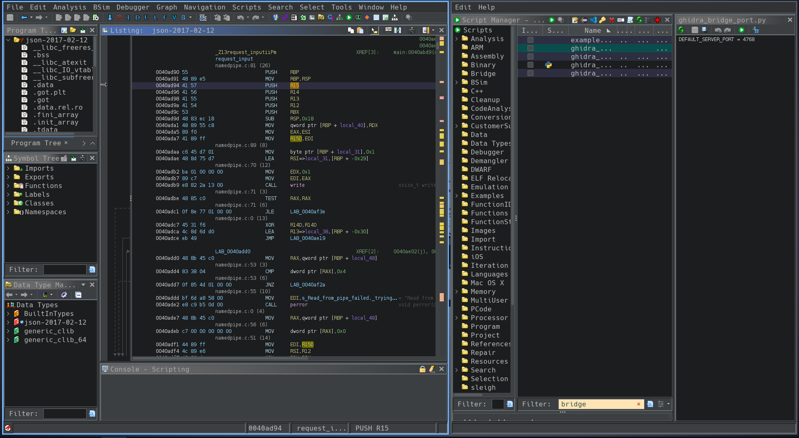
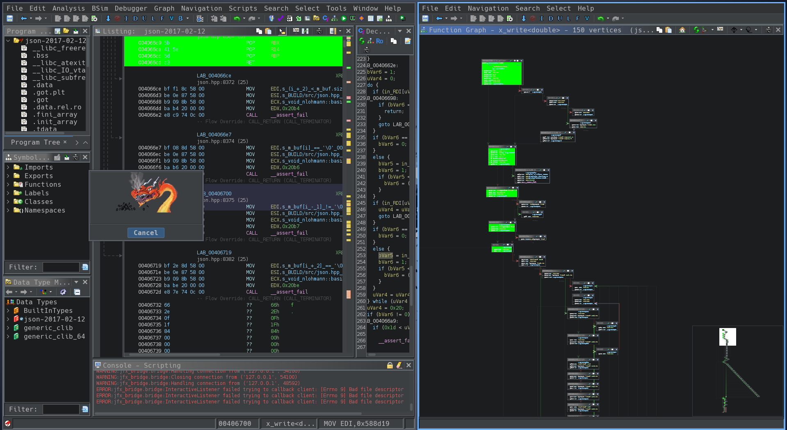
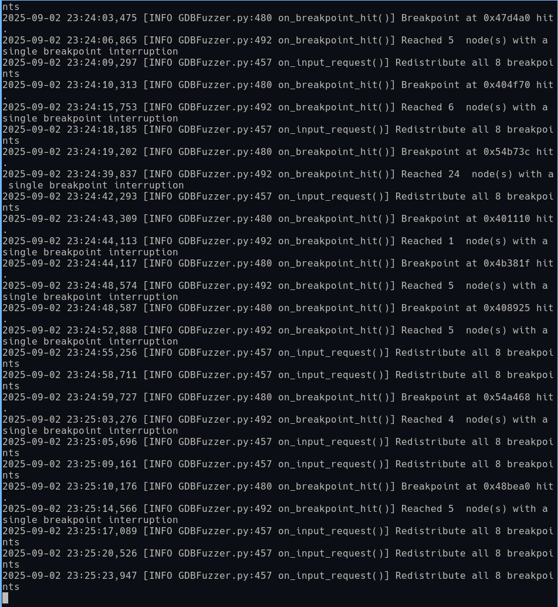
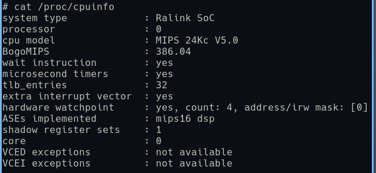
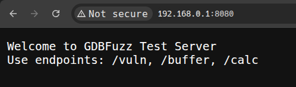

# GDBfuzz: Fuzzing Embedded Systems using Debug Interfaces

前记：在对 DIR-816路由器 的漏洞 CVE-2025-5623 的复现过程中，发现这是一个典型的内存溢出漏洞，利用该漏洞可以控制路由器的内存，从而实现对路由器的控制。为了进一步研究该漏洞和学习相关fuzz工具，模拟漏洞发现过程，我们使用了 GDBfuzz 这个工具来对路由器进行 fuzzing 测试。 

相关论文在 `docs/Fuzzing Embedded Systems using Debug Interfaces.pdf`

## GDBfuzz 的安装和测试

首先，从最基础的安装和使用学习 gdbfuzz 这个工具。

```
git clone https://github.com/F145H-F145H/gdbfuzz
cd gdbfuzz
```

根据 `README.md` 文档，我们最好使用一个独立的 python 环境，且最好是 3.10 版本，笔者在 python3.13 环境下安装依赖时遇到了错误。在 `make` 的过程中，如果遇到错误或网络问题等，可以根据 `Makefile` 文件手动解决问题。

```bash
conda create -n python310 python=3.10
conda activate python310 
# 这里我使用 miniconda 管理python版本，可以在这里进行安装： 
# https://www.anaconda.com/docs/getting-started/miniconda/install#linux-2

python3 -m venv .venv
source .vnev/bin/activate # 使用本地虚拟环境

make
chmod a+x ./src/GDBFuzz/main.py
```

安装完成后，我们可以由简到繁地进行测试。首先，我们打开./为了进一步观察 fuzz 过程，我们使用 Ghidra 打开测试程序，使用 `Script Manager`，搜索 `bridge` 关键字，找到 `ghidra_bridge_port.py` 设置端，然后运行 `ghidra_bridge_server_background.py`，注意 .cfg 文件的端口需要和这里保持一致。



然后使用 `python3 ./src/GDBFuzz/main.py --config ./example_programs/fuzz_json.cfg` 运行fuzz程序，一段时间后，我们可以看到 gdbfuzz 在不断切换和测试新的断点。被命中的部分在 Ghidra 被标记为绿色。





在运行完 `total_runtime` 时间后，可以通过检查 `output_directory` 内的信息查看结果，和其他fuzz工具一样，我们尤其关注 `crashes` 目录。

进一步的，我们编译一个简单的 `buggy_webserver` 程序，用于模拟一个最小化的真实环境，包含一个简单的服务。

### 交叉编译工具环境

下载交叉编译工具以构建适用于当前设备架构的 `gdbserver` 等程序。

```bash
axel -n 4 https://buildroot.org/downloads/buildroot-2025.05.1.tar.gz
tar -xf ./buildroot-2025.05.1.tar.gz
```

我们本次实验的目标为 DIR-816路由器，根据先前的信息可以知道，其运行的程序通常是 `32位` `MIPS` 小端序的，通过 `/proc/cpuinfo` 我们得到更多详细的信息，例如这个机器支持几个硬件断点，对于gdbfuzz来说，这是至关重要的。

第一步，根据需要设置 `buildroot` 配置（注意，在 `toolchain` 中需要打开 **c++支持** 和 **宽字符支持** ，否则可能无法编译新版本的 `gdb`）。然后修改和运行自动脚本便可完成 `gdb` 依赖和本体的编译。



设置

- Target options  --->
    - Target Architecture (MIPS (little endian))
    - Target Architecture Variant (Generic MIPS32R2)
- Toolchain  --->
    - C library (uClibc-ng)
    - -*- Enable WCHAR support
    - [*] Enable toolchain locale/i18n support
    - [*] Thread library debugging
    - [*] Enable C++ support
    - [*] Build cross gdb for the host
- Target packages  --->
    - Debugging, profiling and benchmark  --->
        - [*] gdb
        - -*-   gdbserver

```
cd buildroot-2025.05.1
make menuconfig
make -j16
```

编译完成获得可执行文件后，我们将其放到本地 `tftp` 服务中，使用 `minicom` 连接路由器，下载 `gdbserver` 和 `server` 并运行检测到正确回显和连接便说明我们已经完成了 `gdbserver` 的配置工作。

```bash
iptables -A INPUT -p all -j ACCEPT # 防火墙全开

tftp -g -r gdbserver -l /tmp/gdbserver 192.168.0.2 # 获取 gdbserver
tftp -g -r server -l /tmp/server 192.168.0.2 # 获取 server测试程序
chmod +x /tmp/gdbserver 
chmod +x /tmp/server 
/tmp/gdbserver :1451 /tmp/server &
```

首先，运行并测试程序server功能：



然后，配置gdbserver，使用gdbserver attach到这个程序。
