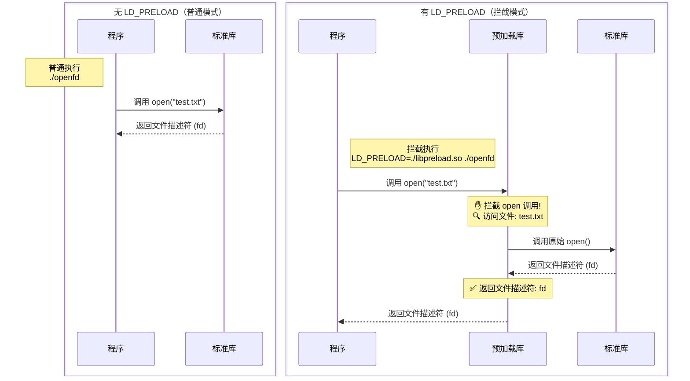
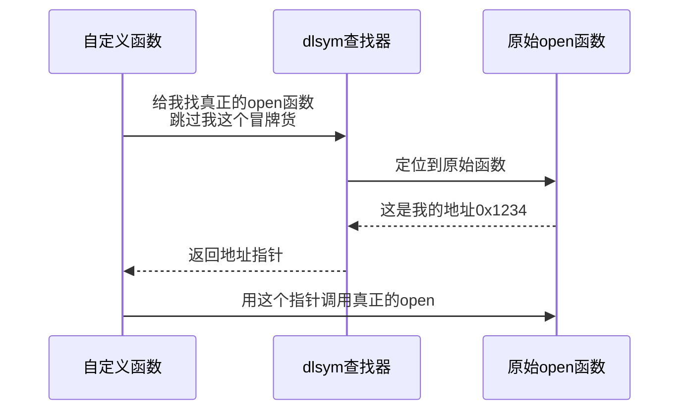
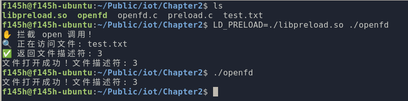

## 模拟固件下的 patch 和 hook

### LD_PRELOAD

LD_PRELOAD 是 Linux 系统中的一个环境变量，它可以影响程序的运行时的链接（Runtime linker），它允许你定义在程序运行前优先加载的动态链接库。

当程序调用一个动态链接库中的函数（如 `printf`, `open`, `malloc`）时，动态链接器负责在已加载的共享库中找到该函数（符号）的实际地址，动态链接器按照特定的顺序搜索共享库来解析符号。`LD_PRELOAD` 赋予指定的库最高的搜索优先级。

这意味着：如果一个函数（例如 `open`）在 `LD_PRELOAD` 指定的库 A 中被定义，同时也在标准库 B（如 `libc.so.6`）中被定义，那么链接器会优先找到并使用库 A 中的 `open` 函数，而完全忽略库 B 中的原始 `open` 函数。

示例如下： 图中虚线表示动态链接过程，实线表示函数调用流程。预加载库通过拦截-转发机制实现了对系统调用的透明监控。



示例 2-1 `openfd.c`

```C
#include <stdio.h>
#include <fcntl.h>
#include <unistd.h>

int main() {
    // 尝试打开文件
    int fd = open("test.txt", O_RDONLY);
    
    if (fd < 0) {
        perror("open 失败");
        return 1;
    }
    
    printf("文件打开成功！文件描述符: %d\n", fd);
    close(fd);
    return 0;
}
```

2-2 `preload.c`

```C
#define _GNU_SOURCE
#include <stdio.h>
#include <dlfcn.h>
#include <fcntl.h>

// 定义原始 open 函数的类型
typedef int (*original_open_t)(const char*, int, ...);

int open(const char *pathname, int flags, ...) {

    // 获取原始 open 函数地址 dlsym 查找下一个 open 作为 original_open
    original_open_t original_open = (original_open_t)dlsym(RTLD_NEXT, "open");
    
    // 打印拦截信息
    printf("✋ 拦截 open 调用!\n");
    printf("🔍 正在访问文件: %s\n", pathname);
    
    // 调用原始 open 函数
    int fd = original_open(pathname, flags);
    
    printf("✅ 返回文件描述符: %d\n", fd);
    return fd;
}
```

关于 dlsym 查找器：实现了当我们劫持了一个库函数时，仍然可以通过 dlsym 来获得原始函数



编译和执行，我们查看最终的效果：

```bash
gcc openfd.c -o openfd # 编译代码

gcc -shared -fPIC preload.c -o libpreload.so -ldl # 编译共享库

echo 'test' > test.txt

./openfd # 正常运行

LD_PRELOAD=./libpreload.so ./openfd # 使用 LD_PRELOAD 运行
```



根据这个示例，我们实现了目标函数的劫持以及原始函数的重新实现，可以在后续的代码处理过程中对库函数进行劫持和处理。在使用过程中，可以使用上例的直接在执行时说明 LD_PRELOAD 参数，也可以通过 export LD_PRELOAD="库文件路径" 设置整个系统的变量

### IDA Ghidra 等

等待补充。