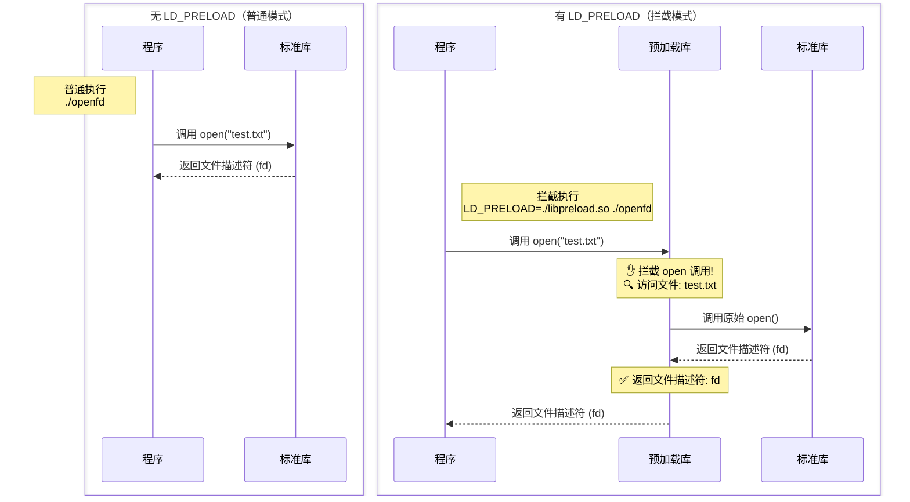
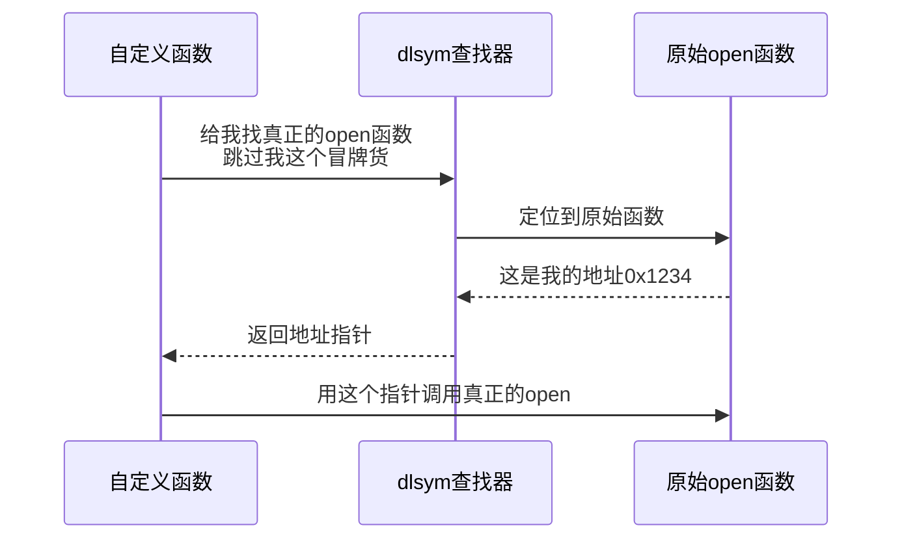
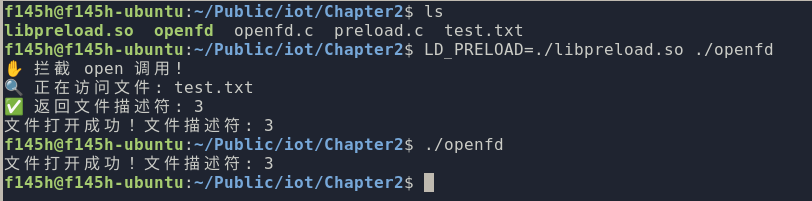

# IoT 相关基础知识杂谈

前记：其实本来这个部分我准备放在最后再整理的，但是在学习各位大佬的博客时，发现 Iot 相关的知识面也是非常宽泛的，“冰冻三尺非一日之寒，滴水石穿非一日之功 。”我想这一部分的知识会进行不断的整理和更新。

## 一些杂谈（关于环境）

2024年7月22日:

距离上次学习 IoT 相关知识，已经过去一周了。这几天我和家人离开南京去了云南旅游。出发时南京地区的气温正达到峰值，而等我们回来时，正好赶上台风带来的降温，也算是碰巧躲过了最热的几天。回来之后，终于可以安心写代码了。

不过，由于系统环境的原因，我弃用了熟悉的 Ubuntu 22.04 和 KDE 桌面，转而使用了较新的 Ubuntu 24.04，桌面也换成了更简洁的 regolith。这种平铺式桌面带来了全新的体验，终于告别了之前窗口横七竖八的状态，让我个人非常喜欢。

而我一直在用的 IDA，它在 Linux 平台上的表现实在让我难以适应。感觉像是处于一种半残废状态，虽然基本功能还能凑合用，但总觉得缺了点什么核心的东西，让人用着不太顺手、效率打折。于是，我决定今后主要转向使用开源的 Ghidra 作为逆向分析工具。

目前来说，Cyberangel 师傅的博客对我有很大的参考、启发和指导作用，甚至可以说我目前为止的内容就是在照抄这位师傅的博客，在此特别感谢。指北：[ Cyberangle 公开知识库 ](https://www.yuque.com/cyberangel/rg9gdm)

## 基础软件食用方法

菜鸟教程 好用爱用：
https://www.cainiaojc.com/linux/linux-command-manual.html

### vim

```bash
vimtutor # 一键变强
```

### binwalk

```bash
binwalk -E file # 查看文件熵值，一条直线一般代表未加密

binwalk -Me file # 循环提取固件
```

### tar

创建归档文件（不压缩）

```bash
tar -cvf archive.tar file1.txt dir/  # 打包文件/目录
```

- -c：创建归档
- -v：显示过程
- -f：指定文件名

解压归档文件

```bash
tar -xvf archive.tar          # 解压到当前目录
tar -xvf archive.tar -C /path  # 解压到指定目录
```

- -x：提取文件
- -C：目标目录

查看归档内容

```bash
tar -tvf archive.tar  # 列出归档内文件详情（权限/大小/时间）
```

压缩与解压

| 压缩类型 | 创建命令                           | 解压命令                   | 适用场景           |
|---------|----------------------------------|---------------------------|-------------------|
| Gzip    | tar -czvf archive.tar.gz files/  | tar -xzvf archive.tar.gz	 | 通用压缩（.tar.gz） |
| Bzip2   | tar -cjvf archive.tar.bz2 files/ | tar -xjvf archive.tar.bz2 | 高压缩比（.tar.bz2）|
| XZ      | tar -cJvf archive.tar.xz files/  | tar -xJvf archive.tar.xz  | 极限压缩（.tar.xz） |
| 自动识别 |                                  | tar -xvf archive.tar.*    | 智能解压任何格式     |

- 压缩：-z(gzip), -j(bzip2), -J(xz)
- 解压：同压缩选项，将 -c 替换为 -x

## 网络环境的设置

为了避免每次开机或开启环境都需要重新配置网桥，我在deepseek的帮助下设置了一个脚本...

```bash
sudo vim /usr/local/bin/setup-bridge-tap.sh
```

```setup-bridge-tap.sh
#!/bin/bash
# 创建网桥
brctl addbr ms_br
ip link set ms_br up
ip addr add 192.168.10.1/24 dev ms_br

# 创建并连接TAP设备
ip tuntap add dev ms_tap mode tap
brctl addif ms_br ms_tap
ip link set ms_tap up
ip addr add 192.168.10.100/24 dev ms_tap
```

```bash
sudo chmod +x /usr/local/bin/setup-bridge-tap.sh
sudo vim /etc/systemd/system/bridge-tap.service 
```

```bridge-tap.service
[Unit]
Description=Setup Bridge and TAP for Custom Network
After=network.target
Requires=network.target

[Service]
Type=oneshot
ExecStart=/usr/local/bin/setup-bridge-tap.sh

[Install]
WantedBy=multi-user.target
```

```bash
sudo systemctl daemon-reload
sudo systemctl enable bridge-tap.service 
```

完成配置后重启，查看 `ifconfig` 合乎预期就认为是配置成功啦。

## G502 侧键别浪费了

使用 `xbinkeys` 将侧键绑定为 `Alt`+`左右方向键` 帮助我在浏览器和Ghidra等应用中快速切换位置。
还有滚轮的左右健改为切换桌面。

```bash
sudo apt install xbindkeys xdotool
xbindkeys --defaults > ~/.xbindkeysrc
vim ~/.xbindkeysrc
killall xbindkeys && xbindkeys
```

```.xbinkeys
# 绑定鼠标按钮6 -> Alt + Super + 左方向键 (向左切换桌面)
"xdotool key --delay 50 alt+Super+Left"
  b:6 + Release

# 绑定鼠标按钮7 -> Alt + Super + 右方向键 (向右切换桌面)
"xdotool key --delay 50 alt+Super+Right"
  b:7 + Release

# 绑定鼠标按钮8 -> Alt + 左方向键 (浏览器后退)
"xdotool key --delay 50 alt+Left"
  b:8 + Release

# 绑定鼠标按钮9 -> Alt + 右方向键 (浏览器前进)
"xdotool key --delay 50 alt+Right"
  b:9 + Release
```

## 模拟固件下的 patch 和 hook

### LD_PRELOAD

LD_PRELOAD 是 Linux 系统中的一个环境变量，它可以影响程序的运行时的链接（Runtime linker），它允许你定义在程序运行前优先加载的动态链接库。

当程序调用一个动态链接库中的函数（如 `printf`, `open`, `malloc`）时，动态链接器负责在已加载的共享库中找到该函数（符号）的实际地址，动态链接器按照特定的顺序搜索共享库来解析符号。`LD_PRELOAD` 赋予指定的库最高的搜索优先级。

这意味着：如果一个函数（例如 `open`）在 `LD_PRELOAD` 指定的库 A 中被定义，同时也在标准库 B（如 `libc.so.6`）中被定义，那么链接器会优先找到并使用库 A 中的 `open` 函数，而完全忽略库 B 中的原始 `open` 函数。

示例如下： 图中虚线表示动态链接过程，实线表示函数调用流程。预加载库通过拦截-转发机制实现了对系统调用的透明监控。



示例 2-1 `openfd.c`

```C
#include <stdio.h>
#include <fcntl.h>
#include <unistd.h>

int main() {
    // 尝试打开文件
    int fd = open("test.txt", O_RDONLY);
    
    if (fd < 0) {
        perror("open 失败");
        return 1;
    }
    
    printf("文件打开成功！文件描述符: %d\n", fd);
    close(fd);
    return 0;
}
```

2-2 `preload.c`

```C
#define _GNU_SOURCE
#include <stdio.h>
#include <dlfcn.h>
#include <fcntl.h>

// 定义原始 open 函数的类型
typedef int (*original_open_t)(const char*, int, ...);

int open(const char *pathname, int flags, ...) {

    // 获取原始 open 函数地址 dlsym 查找下一个 open 作为 original_open
    original_open_t original_open = (original_open_t)dlsym(RTLD_NEXT, "open");
    
    // 打印拦截信息
    printf("✋ 拦截 open 调用!\n");
    printf("🔍 正在访问文件: %s\n", pathname);
    
    // 调用原始 open 函数
    int fd = original_open(pathname, flags);
    
    printf("✅ 返回文件描述符: %d\n", fd);
    return fd;
}
```

关于 dlsym 查找器：实现了当我们劫持了一个库函数时，仍然可以通过 dlsym 来获得原始函数



编译和执行，我们查看最终的效果：

```bash
gcc openfd.c -o openfd # 编译代码

gcc -shared -fPIC preload.c -o libpreload.so -ldl # 编译共享库

echo 'test' > test.txt

./openfd # 正常运行

LD_PRELOAD=./libpreload.so ./openfd # 使用 LD_PRELOAD 运行
```



根据这个示例，我们实现了目标函数的劫持以及原始函数的重新实现，可以在后续的代码处理过程中对库函数进行劫持和处理。在使用过程中，可以使用上例的直接在执行时说明 LD_PRELOAD 参数，也可以通过 export LD_PRELOAD="库文件路径" 设置整个系统的变量
