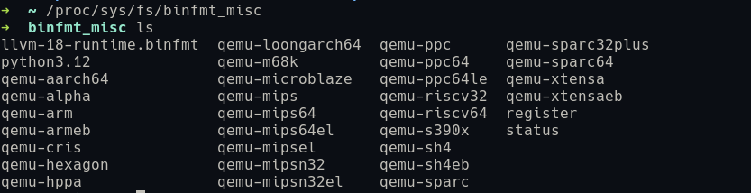
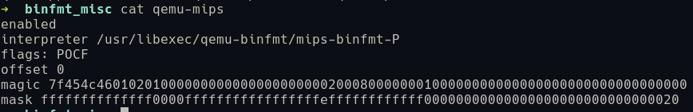

利用binfmt_misc机制加快CGI调试

学习参考文章 
[ 奇安信天工实验室 利用binfmt_misc机制加快CGI调试](https://mp.weixin.qq.com/s?__biz=Mzk0OTU2ODQ4Mw==&mid=2247487412&idx=1&sn=c54f5b26b7a14a4ec76dfdf866684f57&chksm=c2ebddafc36bbf1ac3308a5cda98e2e478cced85a3a8dc1309c3c40c9ebfb1984273414a5833)
[ 姚红 binfmt_misc ](https://www.cnblogs.com/yaohong/p/17481358.html)
[ binfmt_misc Wikipedia ](https://zh.wikipedia.org/wiki/Binfmt_misc)

---

`binfmt_misc` 是 Linux 内核的一项功能，其使得内核可识别任意类型的可执行文件格式并传递至特定的用户空间应用程序，如模拟器和虚拟机，它是内核中准备用户空间程序运行的诸多二进制格式文件处理程序之一 。例如，可以用它来自动运行 Java 或 Python 脚本，或在 x86_64 系统上运行 ARM 二进制文件等。这里，我们可以通过 `binfmt_misc` 这项功能来简化和加速跨平台文件的调试过程。

在许多文章中提到使用 `binfmt_misc` 往往需要先将其挂载，但是在笔者的系统上（Ubuntu 24.04）已经不再需要手动进行挂载。所以高版本的系统大多可以跳过挂载这个阶段，这一点可以通过命令得到确认，或者是直接运行一个 python 脚本。

```bash
mount | grep binfmt_misc
./test.py
```

在 Linux 系统中，直接“执行” Python 脚本时，`binfmt_misc` 机制会自动调用 `python3 test.py` 来运行脚本。其原理是通过 `binfmt_misc` 机制将以特定格式（如以 `#!` 开头的脚本文件）自动关联到相应的解释器（如 Python 解释器），从而实现无需手动指定解释器即可直接运行脚本文件。

它的配置文件处于 `/proc/sys/fs/binfmt_misc` 目录下，我们可以通过注册或编辑来为一种格式的文件指定解释器。





注册格式如下 `:name:type:offset:magic:mask:interpreter:flags`

