# PMAT-labs Challenge 1: SillyPutty

首先，看一下 README.md 的信息

```markdown
Hello Analyst,

The help desk has received a few calls from different IT admins regarding the attached program. They say that they've been using this program with no problems until recently. Now, it's crashing randomly and popping up blue windows when it's run. I don't like the sound of that. Do your thing!

IR Team

## Objective
Perform basic static and basic dynamic analysis on this malware sample and extract facts about the malware's behavior. Answer the challenge questions below. If you get stuck, the `answers/` directory has the answers to the challenge.

## Tools
Basic Static:
- File hashes
- VirusTotal
- FLOSS
- PEStudio
- PEView

Basic Dynamic Analysis
- Wireshark
- Inetsim
- Netcat
- TCPView
- Procmon

## Challenge Questions:

### Basic Static Analysis
---

- What is the SHA256 hash of the sample?
- What architecture is this binary?
- Are there any results from submitting the SHA256 hash to VirusTotal?
- Describe the results of pulling the strings from this binary. Record and describe any strings that are potentially interesting. Can any interesting information be extracted from the strings?
- Describe the results of inspecting the IAT for this binary. Are there any imports worth noting?
- Is it likely that this binary is packed?
---

### Basic Dynamic Analysis
 - Describe initial detonation. Are there any notable occurrences at first detonation? Without internet simulation? With internet simulation?
 - From the host-based indicators perspective, what is the main payload that is initiated at detonation? What tool can you use to identify this?
 - What is the DNS record that is queried at detonation?
 - What is the callback port number at detonation?
 - What is the callback protocol at detonation?
 - How can you use host-based telemetry to identify the DNS record, port, and protocol?
 - Attempt to get the binary to initiate a shell on the localhost. Does a shell spawn? What is needed for a shell to spawn?

```

现在，我们将围绕这些问题对程序进行分析：

## Basic Static Analysis
首先，使用 pestudio 查看文件基本信息

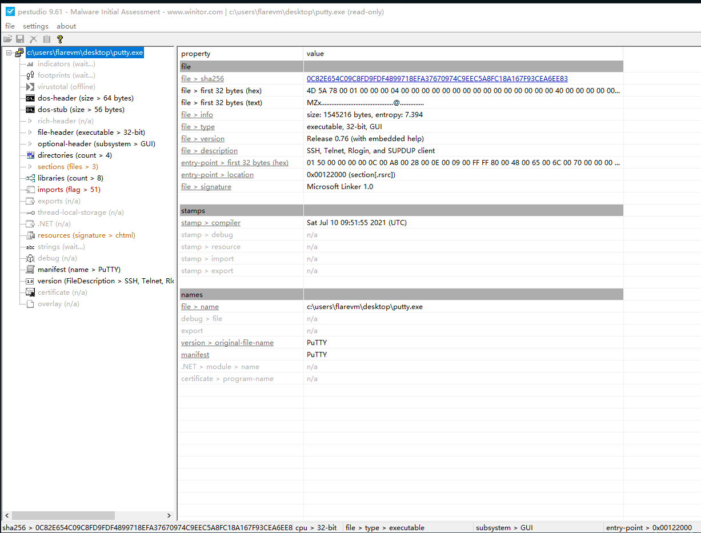

提交 SHA256 到 VirusTotal 查看分析信息：

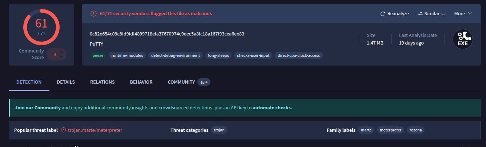

得到以下信息

questions           | answer                
--------------------|------------------------
What is the SHA256 hash of the sample? | 0C82E654C09C8FD9FDF4899718EFA37670974C9EEC5A8FC18A167F93CEA6EE83
What architecture is this binary? | executable, 32-bit, GUI
Are there any results from submitting the SHA256 hash to VirusTotal? | 61/71 security vendors flagged this file as malicious

在 Strings 中， 可以发现一些可疑的符号，可以作为一些线索。

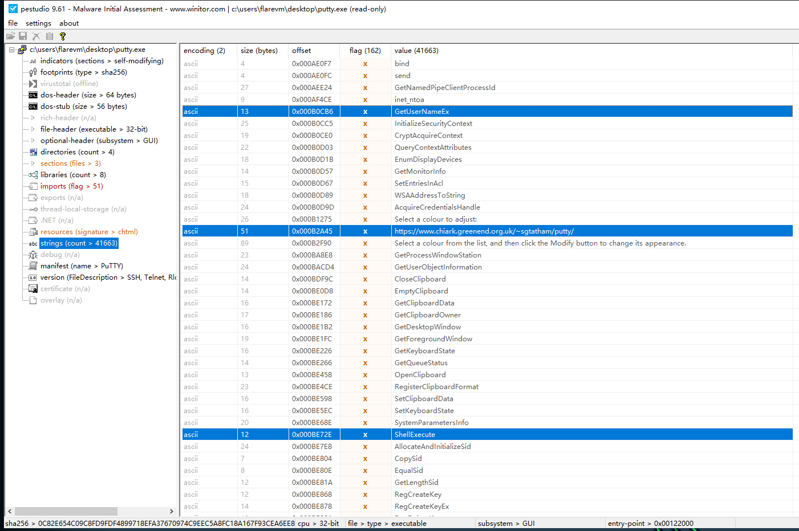

IAT 表中提示了许多危险函数，尤其是大量对于 Clipboard 和 Reg 相关的操作。

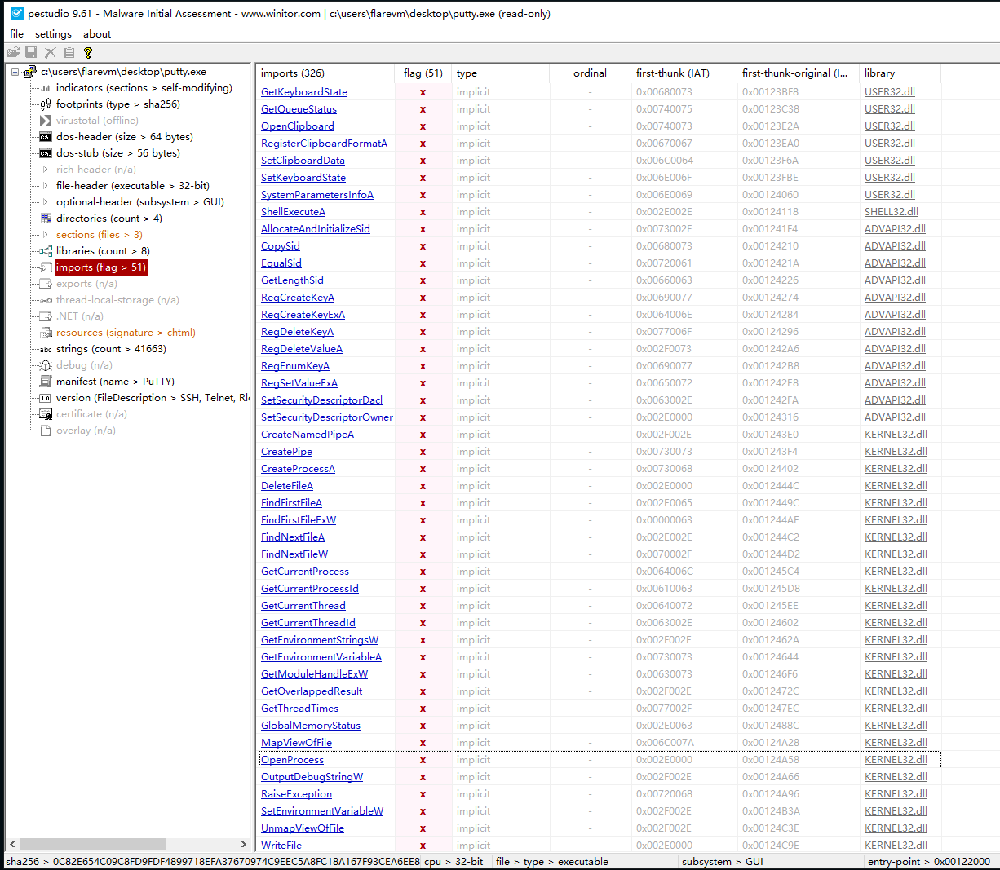

questions           | answer                
--------------------|------------------------
Is it likely that this binary is packed? | nope

## Basic Dynamic Analysis

首先，我直接执行这个程序，它给出的响应和正常程序无异，除了启动时会闪烁一个蓝色的窗口，然后我们启动网络模拟，表现相同。

网络行为分析：

我们查看网络请求，发现程序正在请求 8443 端口的响应，我们运行 netcat 来相应这个请求。

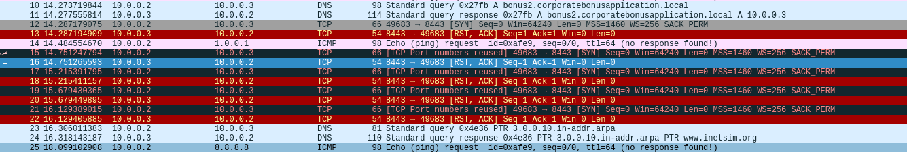

进一步的，我们可以看到程序正在尝试请求：

`bonus2.corporatebonusapplication.local`

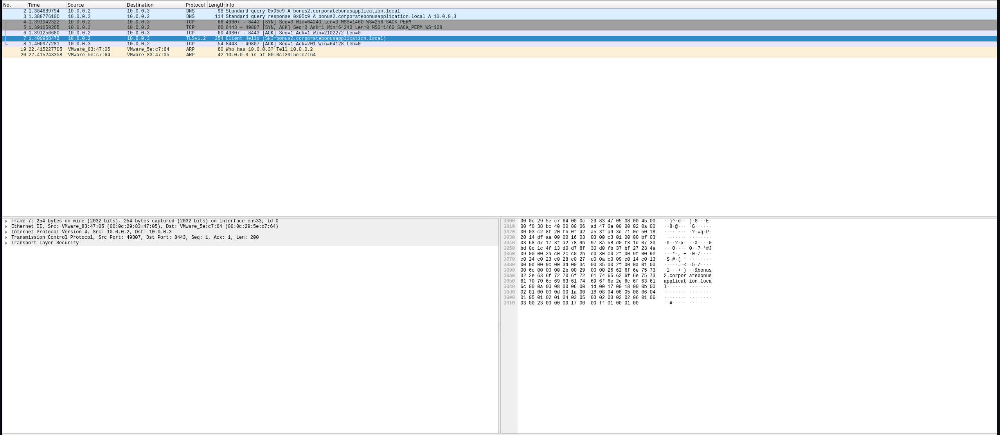

将其写入 host 文件，使得其直接访问 remnux：

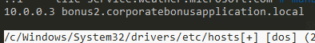

程序行为分析：

使用 procmon 查看程序行为，根据程序开始时出现弹窗的行为，将筛选器设置为 PPID，可以观察到 putty.exe 启动了一个 powershell，并执行了若干条指令和行为，将编码信息使用 cyberchef 解码，得到了一个 powershell 函数，用于创建reverse shell，并且强制要求ssl连接。

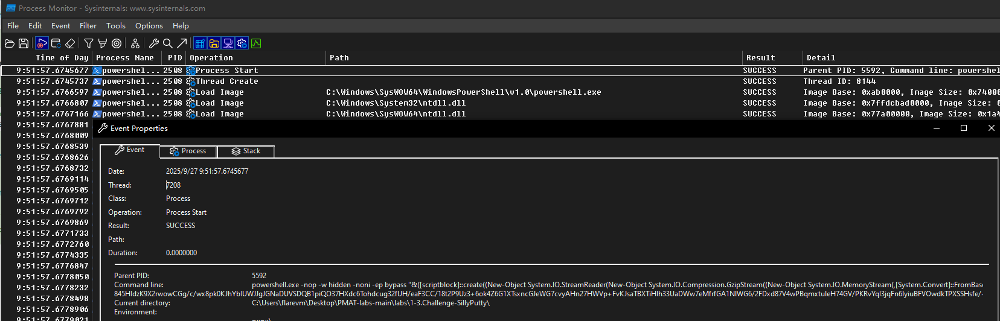

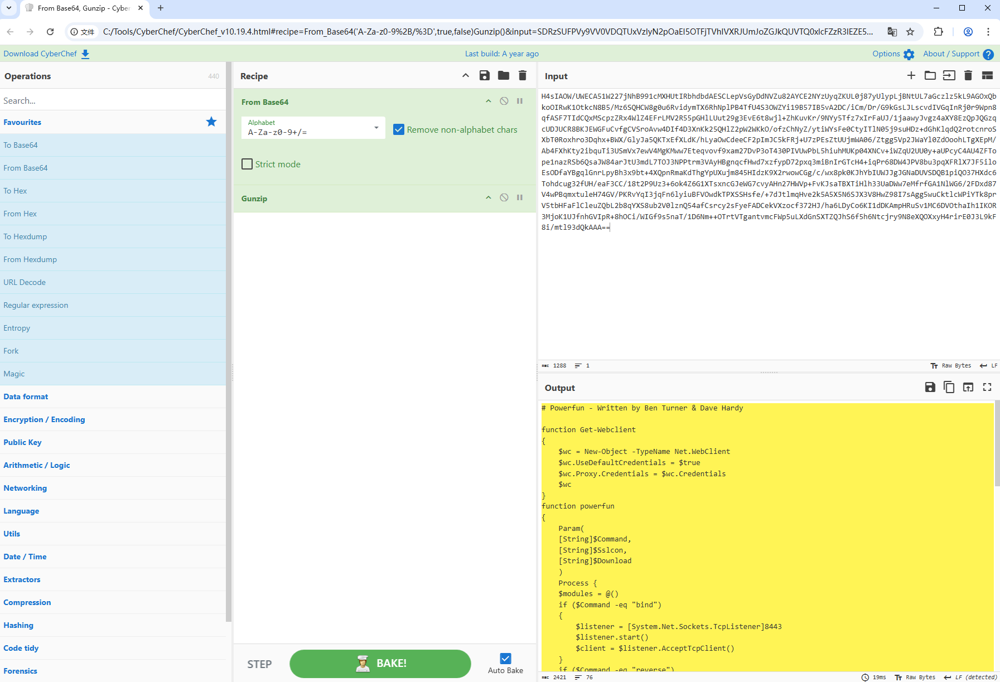

根据上述分析，可以在 remnux 中创建一个简单的 server，用于与其通信。运行脚本后再次启动 putty.exe，可以观察到成功建立了连接，并且可以正常通信，那么我们可以回答问题的所有答案,也完成了基础的分析。

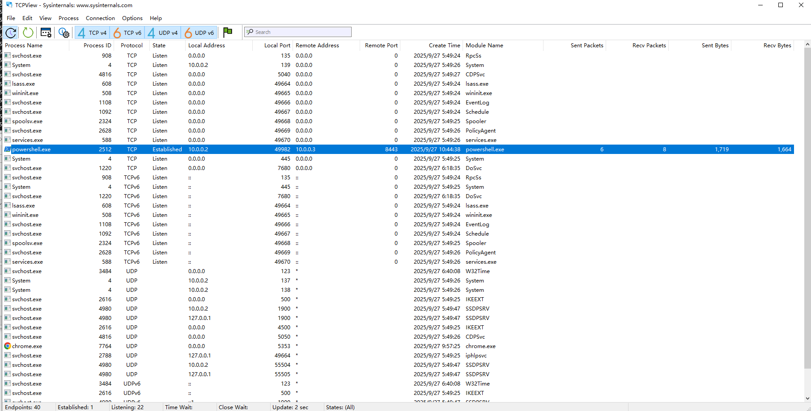

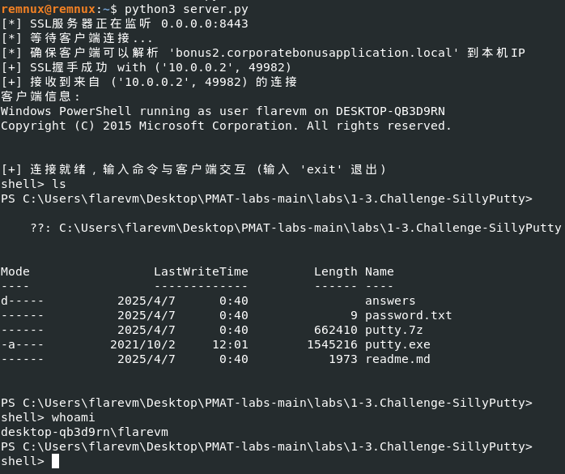
